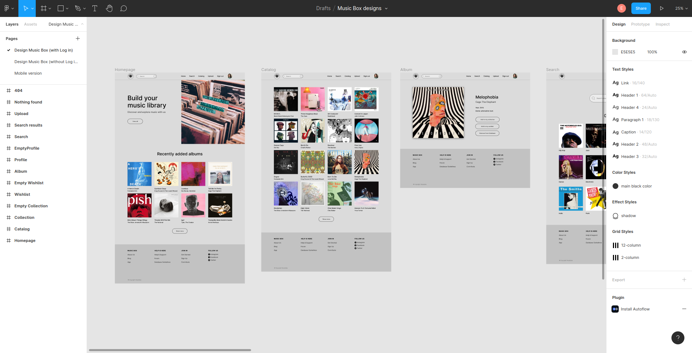
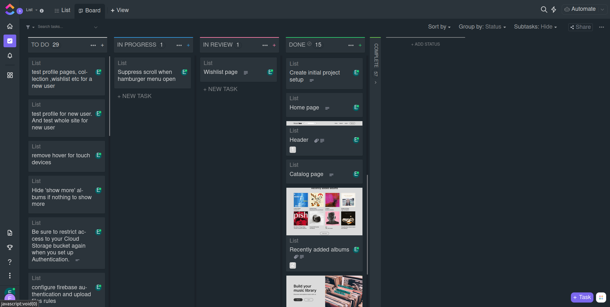

# Music Box

## About project

Music Box is a web App for music collectors who buy music on analog records like vinyls, cd disks, audio tapes, etc. Music Box allow people to track their music collection, add albums to their digital catalog or wishlist and perform search.

## Contents

- [General Info](#general-info)
- [Live Demo](#live-demo)
- [Technologies](#technologies)
- [Features](#features)
- [To-Do](#to-do)

## General Info

This project is a database of information about music artists and albums, a music library. I have built it with the aim to dive deep into React and make a "real-world" application with authentication and realtime database provided by Firebase.
This application uses Firebase authentication system, Firestore for database and Firebase Storage for image uploads.

## Live Demo

live demo: https://eprikhodko.github.io/music-box/

## Technologies

Project created with:

- React 17.0.2
- Firebase 9.2.0
- React Router 5.3.0
- Styled Components 5.3.1

## Features

Features for unauthenticated users:

- view recently added albums
- view album details
- view music catalog
- search albums through database

for authenticated users only:

- add/remove albums to/from collection
- upload new albums to the database
- view all albums uploaded by the current user

## How I worked on this project

- I received designs of the website which were made in Figma: 
- Next I created project in a Click-Up kanban board and broke down designs into smaller tasks: 
- During the rest of the work on this project I continued to break big features into the smaller tasks and then implemented them one by one.
- I also used feature branches and Pull Requests: [Link to example PR](https://github.com/eprikhodko/music-box/pull/18)

## To-Do

- add Russian language support

## Available Scripts

In the project directory, you can run:

### `yarn start`

Runs the app in the development mode.\
Open [http://localhost:3000](http://localhost:3000) to view it in the browser.

The page will reload if you make edits.\
You will also see any lint errors in the console.

### `yarn test`

Launches the test runner in the interactive watch mode.\
See the section about [running tests](https://facebook.github.io/create-react-app/docs/running-tests) for more information.

### `yarn build`

Builds the app for production to the `build` folder.\
It correctly bundles React in production mode and optimizes the build for the best performance.

The build is minified and the filenames include the hashes.\
Your app is ready to be deployed!

See the section about [deployment](https://facebook.github.io/create-react-app/docs/deployment) for more information.

### `yarn eject`

**Note: this is a one-way operation. Once you `eject`, you can’t go back!**

If you aren’t satisfied with the build tool and configuration choices, you can `eject` at any time. This command will remove the single build dependency from your project.

Instead, it will copy all the configuration files and the transitive dependencies (webpack, Babel, ESLint, etc) right into your project so you have full control over them. All of the commands except `eject` will still work, but they will point to the copied scripts so you can tweak them. At this point you’re on your own.

You don’t have to ever use `eject`. The curated feature set is suitable for small and middle deployments, and you shouldn’t feel obligated to use this feature. However we understand that this tool wouldn’t be useful if you couldn’t customize it when you are ready for it.

## Learn More

You can learn more in the [Create React App documentation](https://facebook.github.io/create-react-app/docs/getting-started).

To learn React, check out the [React documentation](https://reactjs.org/).

### Code Splitting

This section has moved here: [https://facebook.github.io/create-react-app/docs/code-splitting](https://facebook.github.io/create-react-app/docs/code-splitting)

### Analyzing the Bundle Size

This section has moved here: [https://facebook.github.io/create-react-app/docs/analyzing-the-bundle-size](https://facebook.github.io/create-react-app/docs/analyzing-the-bundle-size)

### Making a Progressive Web App

This section has moved here: [https://facebook.github.io/create-react-app/docs/making-a-progressive-web-app](https://facebook.github.io/create-react-app/docs/making-a-progressive-web-app)

### Advanced Configuration

This section has moved here: [https://facebook.github.io/create-react-app/docs/advanced-configuration](https://facebook.github.io/create-react-app/docs/advanced-configuration)

### Deployment

This section has moved here: [https://facebook.github.io/create-react-app/docs/deployment](https://facebook.github.io/create-react-app/docs/deployment)

### `yarn build` fails to minify

This section has moved here: [https://facebook.github.io/create-react-app/docs/troubleshooting#npm-run-build-fails-to-minify](https://facebook.github.io/create-react-app/docs/troubleshooting#npm-run-build-fails-to-minify)
